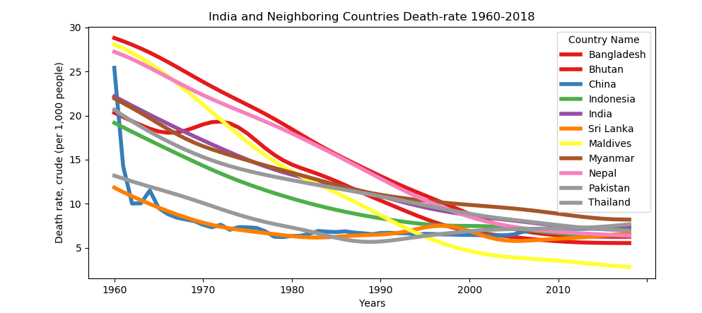

# Death-rate-Analysis
Analysis of Death-rate of India and its neighbouring countries, it includes Bangladesh, Bhutan, China, Myanmar, Nepal, Pakistan, Indonesia, Thailand, Sri Lanka, Maldives. I am analysing data from 1960-2018.

Research Questions:
1. Which Country has the least death rate and state its reason?
2. Which Country has improved their death rate fastest and what can be the reason for it?

Graph:

